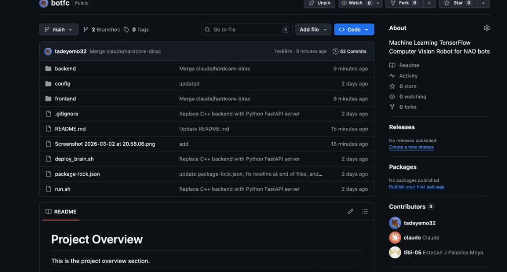
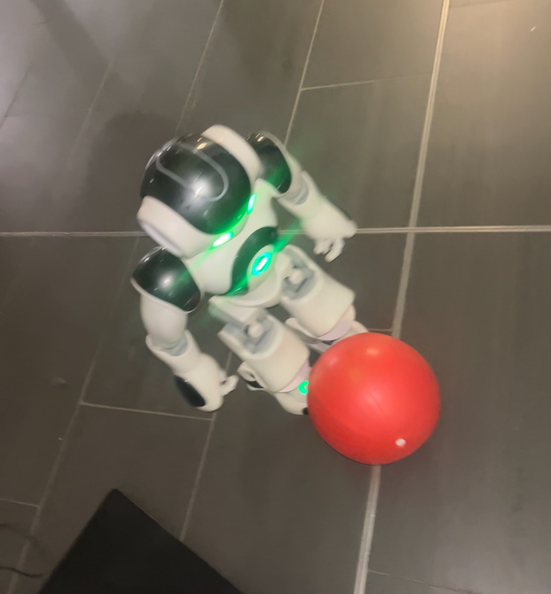

# BotFC - Intelligent Autonomous Humanoid Robotics

An end-to-end intelligent perception and control system designed for the NAO humanoid robot platform. BotFC integrates real-time computer vision, physics simulation, and a custom-built low-latency C++ machine learning engine to achieve autonomous robotic capabilities.


*BotFC Match Live Dashboard showing real-time AI telemetrics, object tracking, and robot state from the robot's point of view.*

---

## 🧠 System Architecture


*The BotFC Artificial Intelligence & Decision Making architecture loop, combining perception, robust C++ decision making, and adaptation.*

BotFC operates on a high-frequency Perception-Decision-Action loop:
1. **Perception**: Real-time OpenCV vision processing extracts features like ball position, distance, and robot pose.
2. **Decision Engine**: Our custom-built, lightweight **C++ Multi-Layer Perceptron (MLP)** evaluates the telemetrics and infers the optimal state (Search, Approach, Align, Kick).
3. **Action Execution**: The NAO robot's motor control systems execute the computed actions seamlessly.

---

## ⚙️ Environments & Training

BotFC supports a complete pipeline from synthetic data generation to physical deployment:

### Simulation & Training Environment

*Physics simulation built in C++ to generate synthetic telemetry data and rapidly train the custom Neural Network models.*

### Physical Execution

*Real-world testing with the physical NAO humanoid robot, utilizing the generated C++ models for ball tracking and autonomous decision-making over a UDP telemetry stream.*

---

## 🛠 Technology Stack

BotFC has been recently refactored for maximum performance on embedded hardware, dropping heavy dependencies like TensorFlow in favor of a bespoke C++ implementation.

- **Core ML Engine**: Pure C++ (Multi-Layer Perceptron inference and training)
- **Computer Vision**: OpenCV (Python/C++ bindings)
- **Robot Interface**: Python (NAOqi SDK)
- **Networking**: High-speed UDP telemetry streaming
- **Dashboard**: React / Vite (Live match monitoring)

---

## 🚀 Getting Started

1. **Clone the repository**
   ```bash
   git clone https://github.com/tadeyemo32/botfc.git
   cd botfc
   ```

2. **Compile the C++ ML Engine**
   ```bash
   cd backend/ml
   clang++ -std=c++17 train_model.cpp -o train_model
   ./train_model # Generates custom weights from sim data
   
   cd cpp_inference
   cmake . && make
   ```

3. **Deploy the System**
   Launch the overarching dashboard and server, which automatically deploys the brain to the robot:
   ```bash
   ./run.sh balanced
   ```

*(Requires `robot.yaml` to be properly configured with the NAO Bot's IP and credentials).*

---

## 📁 Project Structure

```
botfc/
├── README.md              # Project Documentation
├── run.sh                 # Full system launcher
├── deploy_brain.sh        # Robot SCP/SSH deployment script
├── assets/                # Documentation media & images
├── backend/
│   ├── api/               # Dashboard telemetry API
│   ├── brain/             # Core NAO Python interface
│   └── ml/                # Pure C++ Simulation, Training, & Inference Engine
└── frontend/              # Vite + React Live Match Dashboard
```

## 📜 License & Authors

**Authors**: tadeyemo32, tibi-05  
Please check the repository for license details.

---
*Last Updated: March 2, 2026*
